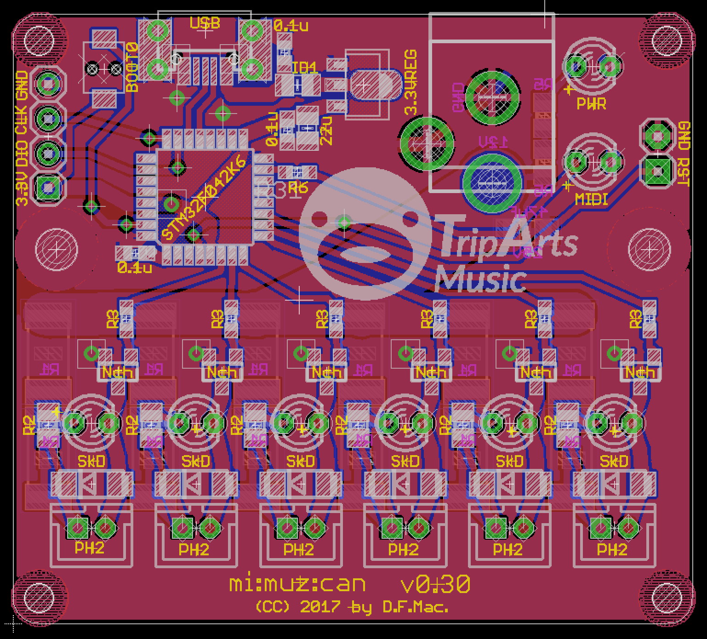

# mi:muz:can (Standard Version)

"mi:muz:can" is a board for build easier to USB-MIDI instrument that sounds up to 6 cans using with push solenoid. For using powerful electric current, It has 2.1mm DC Jack for 12V DC Power supply.

## Version

- v0.30 (2017.05.10)

## Eagle Files

[eagle files (v0.30)](./eagle-files/v0.30)

## parts

- [STM32F042K6T6](http://www.st.com/content/st_com/ja/products/microcontrollers/stm32-32-bit-arm-cortex-mcus/stm32f0-series/stm32f0x2/stm32f042k6.html) * 1
- [HT7333-A (3.3V regulator) SOT89-3](http://www.holtek.com.tw/documents/10179/116711/HT73xx-1v100.pdf) * 1
- [Ferrite beads (0805)](http://akizukidenshi.com/catalog/g/gP-04054/) * 1 [ID1]
- 470Ω(0603) * 1 (For USB DATA LED)
- 1kΩ(0603) * 6 (For FET gate line)
- 1.5kΩ(0805) * 1 (For Power LED)
- 2.2kΩ(0805) * 1 (For Power LED)
- 8.2Ω(2512 1W) * 12 (For Solenoid Line)
- 3mLED * 8 
- 0.1uF(0603) * 3
- 22uF(0805) * 1
- 47uF(1206 25V) * 1
- [Tactical Switch (2 points SMT)](http://www.aitendo.com/product/10525) * 1
- [micro USB Connector](https://www.aliexpress.com/item/Free-shipping-100pcs-lot-4-feet-DIP-5P-SMD-Micro-USB-Connector-V8-Port-Charge-Socket/32214653369.html?spm=2114.13010608.0.0.uwpujb) * 1
- [2.1mm DC Jack](http://akizukidenshi.com/catalog/g/gC-06568/) * 1
- PH2.0 2P Connector * 6
- 1N5819(DO214AC SMD) Shotkey diode * 6
- IRLML6344TRPBF SOT23 (Nch Mosfet) * 6

## Firmware

- [Source](./source)
- [bin](./bin)

### Firmware Setup 

1. Install [SW4STM32](http://www.st.com/content/st_com/ja/products/development-tools/software-development-tools/stm32-software-development-tools/stm32-ides/sw4stm32.html)
2. Install DFU Loader (i.e. dfu-util see [dfu-util - Device Firmware Upgrade Utilities](http://dfu-util.sourceforge.net/))
3. Copy [Source](./source/mimuz-tuch) to your workspace path and select build target `mimuz-can` and Bulding it. When your build process is succeed, `mimuz-can.bin` is created in `./mimuz-can/` folder.
4. push and hold mi:muz:can board switch'BOOT0' switch and connect to USB Port. After connection, you can release switch. `mi:muz:can` board will startup in DFU mode. 
5. Burn [mimuz-can.bin] using DFU Loader. On Mac, enter the following command on terminal in same mimuz-can.bin path.

> `dfu-util -a0 -d 0x0483:0xdf11 -s 0x008000000 -D mimuz-can.bin`

# Licenses

## Hardware (Schematics, Board, Eagle files), Software (Application, USB-MIDI Class Driver)

- [Creative Commons Attribution 4.0 International (CC BY 4.0)](http://creativecommons.org/licenses/by/4.0/)

## Software (STMCube from ST Microsystems)

- 3-clause BSD license

